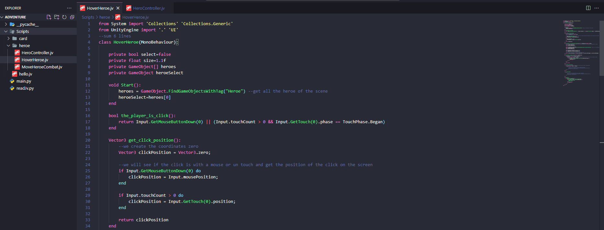

# Unity JV Language Support

Welcome to the Unity JV language extension for Visual Studio Code! This extension provides support for programming in a new language inspired by Python and Lua, designed to streamline and simplify the process of coding for the Unity game engine.


## Features

- **Syntax Highlighting:** Enjoy syntax highlighting tailored for the Unity JV language to make your code visually appealing and easy to read.
- **Code Rewriting:** The interpreter translates Unity JV code into C# compatible with the Unity engine, enhancing the development workflow.
- **Faster Development:** Write code more quickly and intuitively, leveraging the simplicity of the Unity JV language.

## Getting Started

1. Install the extension from the Visual Studio Code Marketplace.
2. Open a file with the extension `.jv` to start using the Unity JV language features.
3. Experience faster and more efficient development within the Unity environment.



## Usage
The Unity JV language aims to make game development in Unity more accessible and efficient. Write code in Unity JV and let the extension handle the translation to C#.

```jv
//------------------------------------------------------Unity JV Example
from System import 'Collections' 'Collections.Generic'
from UnityEngine import '.' 'UI'
--rest 4 lines
class NameClass(MonoBehaviour):
    private bool value=false
    private float num1=10f
    private int num2
    public GameObject prefabs
    private Image image
    public Sprite[] sprite
    private Rigidbody rb 

    void Start():
        print("Hello Unity JV!")
        rb=<RB>
        image=<Image>

        @//
            Debug.Log("Hi Unity"); //this is code C#
        //@
    end
    
    private bool the_player_interacts():
        return Input.GetMouseButtonDown(1)
    end 

    void Update():
        --we will see if the player would like interacts
        if the_player_interacts() do
            --this a debug in JV
            print("Hello Unity JV!")
        end
    end
end
//------------------------------------------------------Translated C# Code
using System.Collections;
using System.Collections.Generic;

using UnityEngine;
using UnityEngine.UI;

//rest 4 lines ;
public class NameClass : MonoBehaviour
{
    private bool value = false;
    private float num1 = 10f;
    private int num2;
    public GameObject prefabs;
    private Image image;
    public Sprite[] sprite;
    private Rigidbody rb;

    void Start()
    {
        Debug.Log("Hello Unity JV!");
        rb = GetComponent<RigidBody>();
        image = GetComponent<Image>();


        Debug.Log("Hi Unity"); //this is code C# 
    }

    private bool the_player_interacts()
    {
        return Input.GetMouseButtonDown(1);
    }

    void Update()
    {
        //we will see if the player would like interacts 
        if (the_player_interacts())
        {
            //this a debug in JV ;
            Debug.Log("Hello Unity JV!");
        }
    }
}

